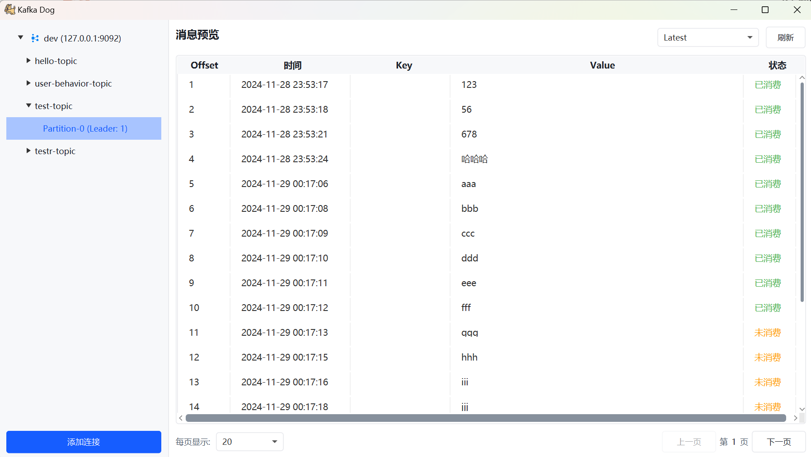

# Kafka Dog

[English](README.en.md) | [简体中文](README.md)

Kafka Dog is a lightweight desktop application for visualizing and managing Apache Kafka. It provides a user-friendly graphical interface for managing and monitoring Kafka clusters.

## ✨ Features

- 🚀 Native desktop client, simple and easy to use
- 📝 Support for multiple connection configuration management
- 🔍 Topic and partition information visualization
- 📊 Message viewing and real-time preview
- 🎯 Support for Latest/Earliest message positioning
- 📦 Support for multiple data formats including String, Avro, Protobuf

## 🖥 Supported Platforms

- Windows

## 📦 Installation & Usage 

### Windows
1.Download the latest version of `KafkaDog-windows-x64.zip`
2.Extract to any directory
3.Double-click to run `KafkaDog.exe`

## 🚀 Quick Start

1. Launch Kafka Dog
2. Click the "Add Connection" button in the bottom left corner
3. In the popup dialog, fill in:
    - Connection name (to identify different connections)
    - Kafka server address
    - Port number (default 9092)
4. Click "Test Connection" to verify connectivity
5. Click "Save" after successful connection
6. In the left panel:
    - Double-click connection name to load Topic list
    - Expand Topic to view partition information
    - Click specific partition to view message content
7. In the right panel:
    - Select Latest/Earliest to switch message position
    - Use pagination controls to browse more messages

## 📸 Interface

## 🔨 Development Plans
- [ ]  Add message sending functionality
- [ ] Add consumer group management
- [ ] Support Topic creation and configuration
- [ ] Add message search functionality
- [ ] Support more message formats (JSON, XML, etc.)

## 🤝 Contributing

If you want to contribute code to Kafka Dog, Pull Requests and Issues are welcome!

## 📄 License

Kafka Dog is licensed under the [MIT License](./LICENSE).

## 🙏 Acknowledgments

- [Apache Kafka](https://kafka.apache.org/)
- [JavaFX](https://openjfx.io/)
- [OpenJDK](https://openjdk.java.net/)

## 📧 Contact

- Author：[Pitayafruits](https://github.com/Pitayafruits)
- Email：[pitaya.cc@qq.com]()

